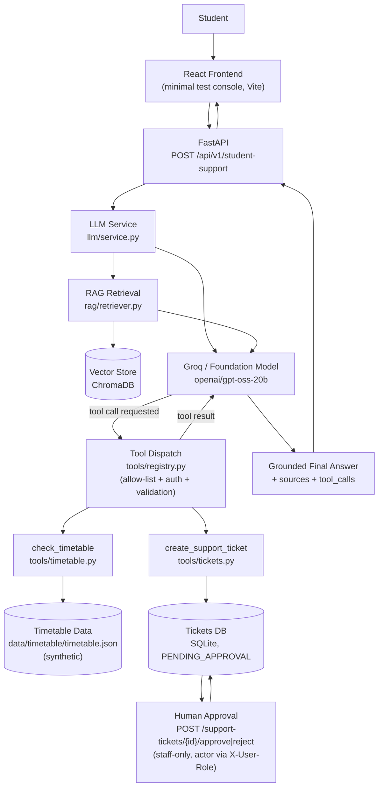

# System Architecture — Weeks 2-4

This is the overall system architecture as of Week 4. For the RAG
pipeline's own internal detail (chunking, embeddings, vector store),
see `docs/rag-architecture.md`; for tool schemas and failure behavior,
see `docs/tool-catalogue.md`.

## Current architecture



Key property: **the model never touches `check_timetable`, `create_support_ticket`, the vector store, or the ticket database directly.** Every arrow into a data store or external effect passes through application code (`tools/registry.py`'s `dispatch_tool_call`, or the authenticated approval endpoints) that validates, authorizes, and — for tool calls — schema-checks the result before it goes back to the model.

## Week 2 → Week 3 → Week 4 progression

```text
WEEK 2 — Foundation Model
Question
   ↓
Prompt (v1.0 / v2.0)
   ↓
Groq
   ↓
Answer
```

```text
WEEK 3 — RAG
Question
   ↓
Retrieve Evidence (vector store)
   ↓
Prompt (rag-v1.0) + Evidence
   ↓
Groq
   ↓
Grounded Answer + Sources
```

```text
WEEK 4 — Tools
Question
   ↓
Retrieve Evidence (still runs, same as Week 3)
   ↓
Prompt (tools-v1.0) + Evidence + Tool Definitions
   ↓
Groq
   ↓
Tool call requested? ──yes──> Tool Dispatch (validate, authorize, execute)
   │                                   │
   no                            Tool Result
   │                                   ↓
   └──────────────< Groq (final answer) <┘
   ↓
Final Answer + Sources + Tool Calls
```

Each week is additive, not a replacement:

- V1.0 and V2.0 (Week 2) still exist in `llm/prompts.py` and are fully tested — only the *default* `active_prompt_version` moved forward.
- RAG retrieval (Week 3) still runs for every `tools-v1.0` request — tool calling sits *alongside* RAG, not instead of it. A question with no timetable/ticket intent gets a normal RAG-grounded answer with `tool_calls: []`; a question with no retrieval-relevant evidence but a clear tool intent gets `sources: []` and a populated `tool_calls`.
- Nothing built in Week 4 (LangGraph, agent loops, persistent memory) belongs to Week 5 — see the Week 4 progress report's "Next phase" section.

## Data flows introduced in Week 4

| Data | Where it lives | Who can write to it |
|---|---|---|
| Timetable sessions | `agent-backend/data/timetable/timetable.json` (synthetic, committed to git) | Nobody at runtime — read-only tool |
| Support tickets | `agent-backend/data/tickets.db` (SQLite, gitignored runtime state) | `create_support_ticket` tool inserts `PENDING_APPROVAL` rows; only the staff-only approve/reject endpoints change a row's status |
