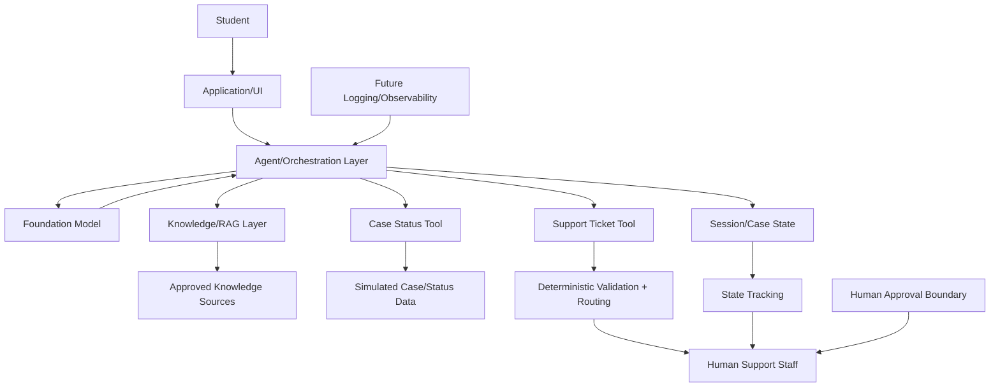

# Initial Architecture and Context Diagram

## Overview
This document describes the initial, planned architecture for the University Student-Support Case Agent. It is intentionally bounded and realistic for an 8-week capstone. The design is not a claim of an already-implemented production architecture; it is the initial architecture for planning, requirements shaping, and future implementation.

## Planned Context

Student
↓
Application/UI
↓
Agent/Orchestration Layer
├── Foundation Model
├── Knowledge/RAG layer
├── Case Status Tool
├── Support Ticket Tool
└── Session/Case State
↓
Human Support Staff

## Description of the Architecture

1. Student
   - The student interacts with the system through a web interface or demo console.
   - The student may ask academic-support questions, request case status, or create a routine support case.

2. Application/UI
   - The interface captures the request and presents the response or case workflow to the student.
   - It does not replace the human support process; it acts as a structured front-end for the bounded workflow.

3. Agent/Orchestration Layer
   - This layer coordinates the workflow between the student input, retrieval needs, and deterministic actions.
   - It can use AI for interpretation, summarization, and workflow assistance.
   - It does not decide sensitive or high-impact outcomes.

4. Foundation Model
   - The model is used for natural-language understanding, intent classification, explanation generation, and workflow guidance.
   - Its use is limited to the approved academic-support domain.

5. Knowledge/RAG Layer
   - This planned layer retrieves approved information from curated source documents or synthetic knowledge artifacts.
   - The project will use approved course, policy, and support material only.
   - This layer should be treated as planned/in-progress and not claimed as implemented yet.

6. Case Status Tool
   - Provides access to simulated case-status or timetable information.
   - This tool is expected to be deterministic and validated against predefined rules.
   - It is not a live production university system.

7. Support Ticket Tool
   - Creates or updates a simulated support ticket or case record.
   - The structure and status transitions are controlled by deterministic business rules.

8. Session/Case State
   - Maintains the active case context during a workflow.
   - This helps the system track the current user request and case information in a traceable way.

9. Human Support Staff
   - Human review is required for escalations, ambiguous cases, or any path involving sensitive or high-impact decisions.
   - Human staff remain the authority for final judgment where institutional, disciplinary, or high-impact actions are concerned.

## Approved Knowledge Sources
Planned and approved sources include:
- synthetic or team-created academic-support policy examples
- approved course handbook or policy summaries
- curated university support procedure summaries
- simulated timetable and case-status datasets created for demonstration

The project does not use confidential or personal institutional data.

## Deterministic Validation and Authorization
The architecture includes deterministic responsibilities such as:
- input validation
- authorized record access
- routing rules for support categories
- support-ticket creation and state transitions
- preventing unsupported actions or unauthorized data access

These responsibilities should remain independent from the model’s free-form language behavior.

## Human Approval Boundary
Human approval is required before:
- any escalation beyond the bounded case workflow
- any decision concerning grading, admissions, fees, disciplinary action, medical issues, or legal matters
- any action where academic or operational risk is high

## Future Logging and Observability
The architecture includes a future observability layer for:
- request and response logging
- retrieval activity traces
- case-state transitions
- rule validation logs
- human review and approval records

These items are part of the future engineering plan and should be added in later project phases.

## Mermaid Diagram

## Notes
- This is the initial architecture for the project, not a production implementation claim.
- AI, retrieval, and orchestration are planned but not yet fully implemented.
- Deterministic controls remain central to project safety and traceability.
