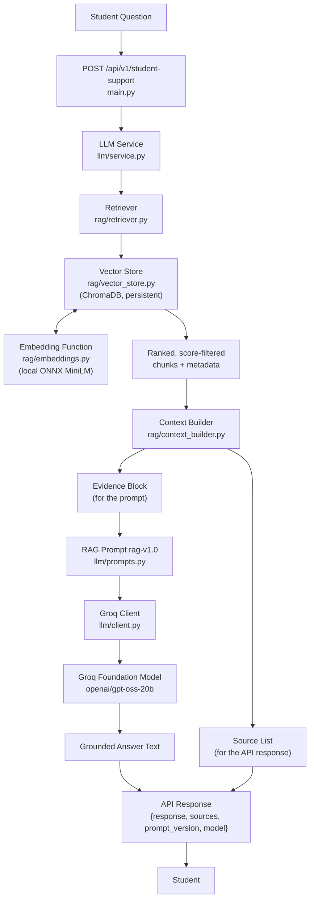
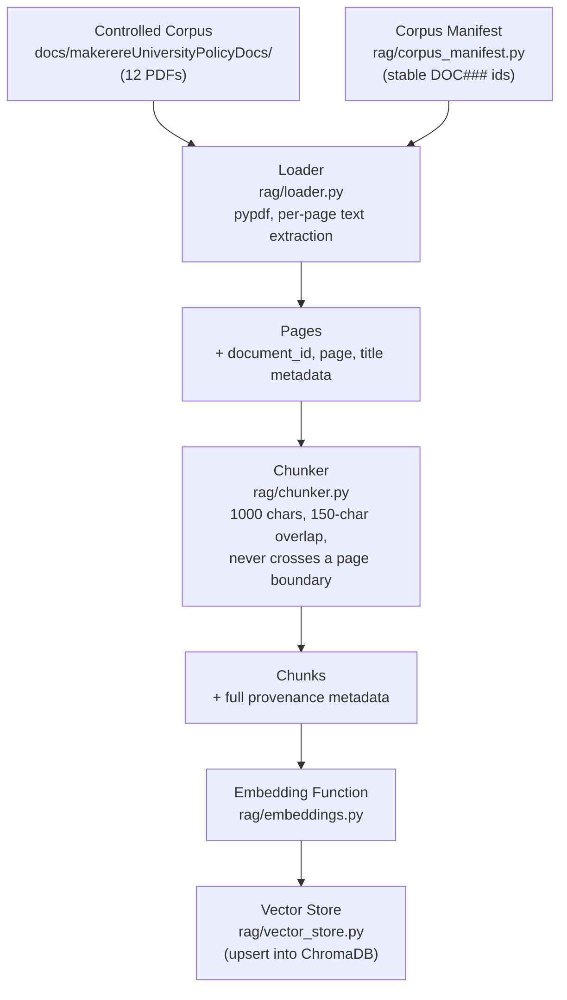

# RAG Architecture — Week 3

This documents the actual implemented retrieval-augmented generation
pipeline behind `POST /api/v1/student-support`. Module names below are
real files in `agent-backend/`, not illustrative placeholders.

## End-to-end flow

## Ingestion (offline, run via `python ingest.py`)

## Stage-by-stage

**Corpus.** 12 real, public Makerere University policy PDFs in `docs/makerereUniversityPolicyDocs/`. Provenance for every document (stable `DOC###` id, title, type, version/date, notes) is tracked in `agent-backend/rag/corpus_manifest.py` and mirrored for humans in `docs/corpus-source-register.md`. 6 originally-included PDFs were removed after ingestion revealed they were scanned images with no extractable text (see `docs/rag-failures.md`, F1).

**Ingestion.** `rag/loader.py` walks the corpus directory, and for every file registered in the manifest, extracts text page-by-page with `pypdf`. Files not in the manifest are skipped with a warning rather than silently indexed with no provenance. Pages with no extractable text are skipped.

**Chunking.** `rag/chunker.py` splits each page's text into 1000-character chunks with 150-character overlap. Chunking never crosses a page boundary, so every chunk's page number is exact, not approximate. Each chunk carries `document_id`, `document_name`, `doc_type`, `version_or_date`, `page`, and a deterministic `chunk_id` (e.g. `DOC018-p1-c0`) so re-ingestion overwrites rather than duplicates.

**Embeddings.** `rag/embeddings.py` isolates the embedding model behind one function. It currently returns ChromaDB's default embedding function — a small MiniLM model run locally via `onnxruntime` (downloaded once, cached afterward). No API key, no PyTorch dependency, no per-call cost. The same function embeds both documents (at ingestion) and queries (at retrieval time), which is required for the vectors to be comparable.

**Vector store.** `rag/vector_store.py` wraps a persistent ChromaDB client (`data/chroma/`, gitignored — regenerated via `python ingest.py`, not committed). The collection is configured with `hnsw:space: cosine`, so raw Chroma distances are converted to an intuitive 0-1 similarity score (`1 - distance`) rather than an unbounded L2 value.

**Retrieval.** `rag/retriever.py` embeds the student's question with the same embedding function, queries the vector store for the top-k nearest chunks (`RAG_TOP_K`, default 4), and filters out anything below `RAG_MIN_SCORE` (default 0.35, calibrated empirically against real corpus queries — see `docs/rag-failures.md` for where this threshold still isn't strict enough). An empty result list is a real, deliberate signal that a question may be unanswerable from the corpus.

**Context construction.** `rag/context_builder.py` takes the same retrieved chunks and produces two independent outputs: `build_evidence_block` formats them as `[Document: ...] [Page: ...]` blocks for the prompt, and `build_sources` deduplicates them into the structured source list for the API response. Both are built from retrieval metadata directly — the model never generates the source list, so it cannot fabricate a citation that doesn't correspond to something actually retrieved.

**Foundation model.** `llm/prompts.py` defines `rag-v1.0`: a system prompt instructing the model to answer only from the supplied evidence, cite the document it draws from, and explicitly say when the evidence is insufficient rather than guess. `llm/client.py` sends the system prompt and the combined evidence+question as a chat completion to Groq (`openai/gpt-oss-20b`), with typed error handling for configuration, timeout, rate-limit, and malformed-response failures.

**Response.** `main.py` returns `{response, prompt_version, model, sources}` from `POST /api/v1/student-support`. `sources` is `SourceResponse[]` (`document_id`, `document`, `page`) — additive to the Week 2 response shape, so existing clients aren't broken.

**Source attribution.** End-to-end: `document_id` is assigned once in the manifest, carried through every `LoadedPage` → `Chunk` → vector-store metadata → `RetrievedChunk` → `Source` → `SourceResponse`, with no step in between that re-derives or infers it. A page number in a response is always a real page number from the original PDF, never a fabricated or approximated one.

## What Week 3 deliberately does not do

No tools/function calling, no LangGraph/agent orchestration, no persistent memory, no re-ranking step, no OCR, no automatic corpus deduplication — see `docs/rag-failures.md` and the Week 3 progress report's "Plan for Week 4" for what's next.
